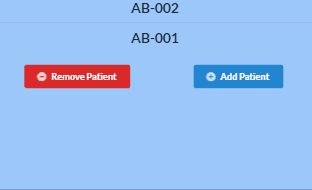

# P.A.D. Stat Tracker
### A web app aiding clinicians in a Mayo Clinic health study.
### Built with React JavaScript, GraphQL, and Amazon Web Services[ DynamoDB, Amplify, AppSync ]

This application was created by Ben Cynamon to assist the research project, *Static Stretching for the Treatment of Peripheral Arterial Disease*, lead by Dr. Emily Pritchard of Florida State University's College of Medicine.

## To Do:
* Wrap app in authentication layer
* Connect EXPORT CSV button 
* Integrate GraphQL subscriptions to PatientList.js
