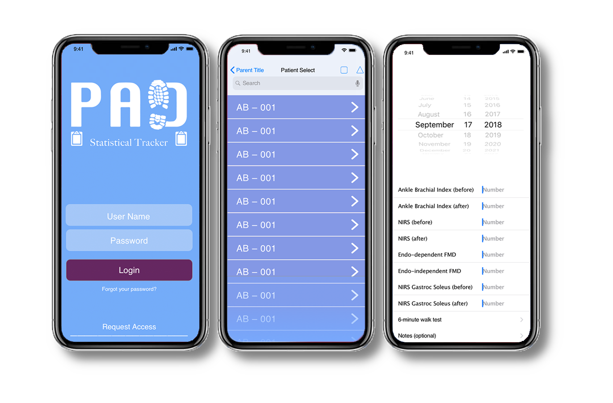

# Peripheral Arterial Disease Data Tracker
A responsive web app aiding clinicians in a Mayo Clinic health study.  
Built with React JavaScript, GraphQL, and Amazon Web Services ( Amplify, AppSync, DynamoDB ).

[Registered user? Login here](https://cynamonster.github.io/pad-stat-track)

### _Role:_
* Project Manager
* Full Stack Developer

### _Services:_
* Initial Ideation
* User Flow Diagrams
* Wire-framing & Mockups
* User Interface Design
* AWS Cloud Server & Database Integration

### _Technologies:_
* HTML5, CSS3
* React Javascript
* Node.js, npm (Node Package Manager)
* AWS Amplify, DynamoDB, S3 Bucket
* GraphQL

This application was created by Ben Cynamon to assist the research study, *Static Stretching for the Treatment of Peripheral Arterial Disease*, lead by Dr. Emily Pritchard of Florida State University's College of Medicine.

### How does it work?

